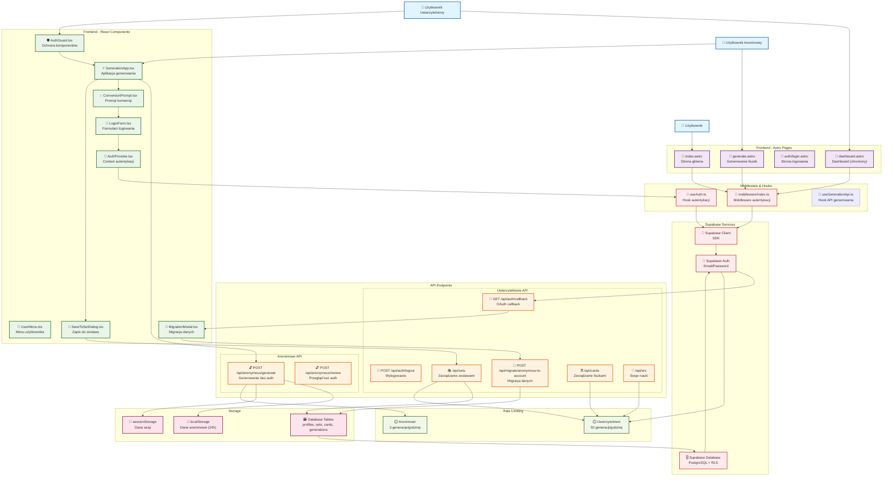

# Diagram architektury systemu autentykacji - Flash Cards AI v2

## Diagram Mermaid

## Opis architektury

### 1. Tryb Anonimowy

- **Użytkownik anonimowy** może korzystać z aplikacji bez logowania
- **Generowanie fiszek** odbywa się przez endpoint `/api/anonymous/generate`
- **Dane przechowywane** w localStorage (24h) i sessionStorage
- **Rate limiting**: 3 generacje na godzinę
- **Prompt konwersji** pojawia się po zaakceptowaniu fiszek

### 2. Tryb Uwierzytelniony

- **Logowanie** przez email/password (Supabase Auth)
- **Pełna funkcjonalność** z persystencją danych
- **Rate limiting**: 50 generacji na godzinę
- **RLS (Row Level Security)** zapewnia izolację danych

### 3. Migracja Danych

- **Wykrycie danych anonimowych** po zalogowaniu
- **Modal migracji** z opcją wyboru zestawu
- **Przeniesienie danych** z localStorage do Supabase
- **Czyszczenie** danych lokalnych po migracji

### 4. Bezpieczeństwo

- **Middleware autentykacji** sprawdza stan na serwerze
- **RLS policies** chronią dane na poziomie bazy
- **Rate limiting** zapobiega nadużyciom
- **JWT tokeny** Supabase zapewniają bezpieczną autentykację

### 5. Komponenty Kluczowe

- **AuthProvider**: Zarządza stanem autentykacji
- **AuthGuard**: Chroni komponenty wymagające logowania
- **MigrationModal**: Obsługuje przeniesienie danych
- **ConversionPrompt**: Zachęca do konwersji z trybu anonimowego

## Scenariusze użycia

### Scenariusz 1: Użytkownik anonimowy

1. Wchodzi na stronę bez logowania
2. Generuje fiszki (dane w localStorage)
3. Przegląda i selekcjonuje fiszki
4. Otrzymuje prompt "Zapisz do konta"
5. Loguje się i migruje dane

### Scenariusz 2: Użytkownik uwierzytelniony

1. Wchodzi na stronę zalogowany
2. Widzi dashboard z zestawami
3. Generuje fiszki (dane w Supabase)
4. Zapisuje do zestawu
5. Rozpoczyna sesję SRS

### Scenariusz 3: Migracja danych

1. System wykrywa dane w localStorage
2. Pojawia się modal migracji
3. Użytkownik wybiera zestaw docelowy
4. Dane są przenoszone do Supabase
5. localStorage jest czyszczony
